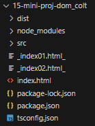

# TSC config

## intitialize
tsc --init
> this will create a tsconfig.json file

## create a dist and src subdirectory under the project directory
| >dist
| >src
| tsconfig.json


## Modify the tsconfig.json file
1. find the line under /* Language and Environment */ and change to es2016.
```json
  /* Language and Environment */
  "target": "es2016",
```

2. add the "include": ["src"] at the end of the json key: value lists:
```json
  "skipLibCheck": true   
},
  "include": ["src"]
}
```
> this is where typescript codes are written

3. remove comment and modify outDir:
```json
"outDir": "./dist",    
```
> this is where transpiled javascript files are placed

## watch mode
tsc -w <ts_filename.ts>
tsc --watch <ts_filename.ts>

## install lite-server
npm -i lite-server

